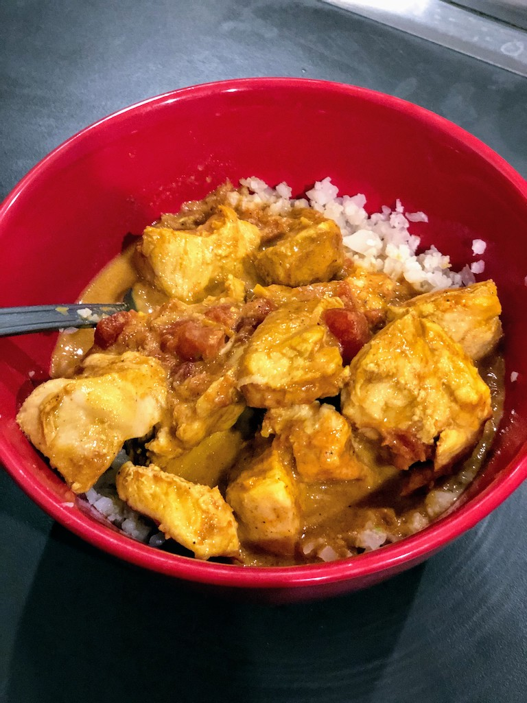

 # Instant Pot Butter Chicken

#### Ingredients

- 14-ounce can diced tomatoes
- 1 small yellow onion - diced
- 5-6 cloves (teaspoons) garlic
- 1 tablespoon minced ginger
- 1 1/2 tablespoon curry powder
- 1 teaspoon garam masala
- 1 teaspoon cayenne pepper
- 1 teaspoon paprika
- 1 teaspoon salt
- 1/2 teaspoon ground cumin
- 1/2 teaspoon turmeric
- 2 pound boneless skinless chicken thighs/breasts

To finish:
- 4 ounces butter cut into cubes (use coconut oil if dairy free)
- 4 ounces heavy cream (use full-fat coconut milk if dairy free)
- 1 teaspoon garam masala

#### Instructions
1. Place all ingredients into an Instant Pot in the order listed except under 'To finish', mixing the sauce well before you place the chicken on top of the sauce. If it's frozen, push it into the sauce a bit so it defrosts better
1. Close the cooker and set for 10 mins on high (plus 1-2 minutes if frozen), and let it release pressure naturally for 10 minutes. After that, release all remaining pressure.
1. Open up the pot and remove the chicken carefully and set aside
1. Blend together all the ingredients, preferably using an immersion blender
1. Let sauce cool slightly before the next step. Add the cut up butter, cream, and garam masala and stir until well incorporated.

Calories 309 | Fat 22g | Protein 23g | Carbs 6g  
[MyFitnessPal Recipe](https://www.myfitnesspal.com/recipe/view/54303338098221)

