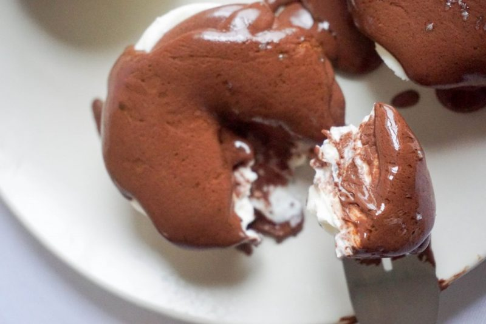

# Keto No Bake Cheesecake

[Easy No Bake Cheesecake - KetoConnect](https://www.ketoconnect.net/easy-no-bake-cheesecake/)

## INGREDIENTS
### Cheese Cake Filling
- 4 oz 1/3 less fat Philadelphia Cream Cheese
- 2 tbsp sour cream
- 1/4 cup [Heavy Whipping Cream](https://amzn.to/2Vb64rp) 
- 1/4 cup [erythritol](https://amzn.to/2SygK1j) 

### Ganache
* 2oz [Unsweetened Bakers Chocolate](https://amzn.to/2rCbLl0) 
* 1/2cup [Heavy Whipping Cream](https://amzn.to/2Vb64rp) 
* splash of water

## INSTRUCTIONS
### Filling
* With hand mixer: cream together cream cheese, sour cream, heavy whipping cream and erythritol.
* Dollop filling into cupcake molds/tin and place in the fridge for 2-3 hours or freezer for 1-2 hours.

### Ganache
* Melt bakers chocolate in microwave.
* Add heavy whipping cream and combine.
* Add splash of water and mix until thick liquid consistency.
* Pour over top frozen cheesecakes.

## Nutrition
- Calories: 323.75 cal
- Carbohydrates: 5.25g | 2.25g Net
- Protein: 4.25g
- Fat: 29g
- Fiber: 3g

